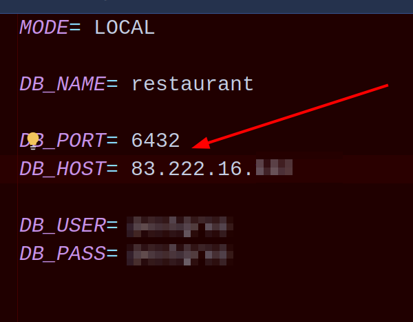
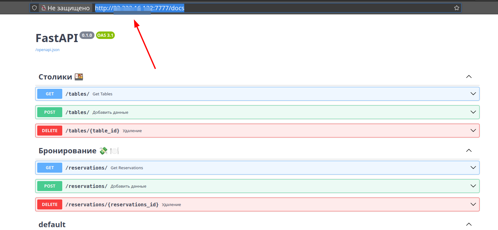

# 🍽️ Тестовое задание: API-сервис бронирования столиков в ресторане

## 📌 Цель
Разработать REST API для бронирования столиков в ресторане. Сервис должен позволять создавать, просматривать и удалять брони, а также управлять столиками и временными слотами.

## Как начать
### Начальные настройки. Раздел №1
* Клонируем репозиторий
```commandline
git clone git@github.com:zatomis/RestApiBeginerTestForStudy.git
```

### Проект может быть развернут на вашем сервере. Используйте dockerfile.
1. Создайте сеть докер
```commandline
docker network create myNetwork
```

2. Создайте образ ! Внимание файл .env должен содержать поля 

```commandline
docker build -t reservation_image .
```

3. Запустите pg sql в докере. Тут указаны пароли в тестовых целях
```commandline
docker run --name reservations_db \
    -p 6432:5432 \
    -e POSTGRES_USER=имя \
    -e POSTGRES_PASSWORD=пароль \
    -e POSTGRES_DB=restaurant \
    --network=myNetwork \
    --volume pg-booking-data:/var/lib/postgresql/data \
    -d postgres:16
```

4. Запустите образ
```commandline
docker run --name reservation_back \
    -p 7777:8000 \
    --network=myNetwork \
    reservation_image
```

5. Запустите в браузере 

```commandline
    http://хх.хх.хх.хх:7777/docs
    где вместо хх - ваш ip адрес сервера
```

## Предварительная подготовка для запуска в Dockercompose

### Запуск

1. Запустить POSTGRES см. п.1.3 
2. Если не создана сеть докер - создайте её п.1.1. 
3. docker compose up -d

## Предварительная подготовка для запуска в Dockercompose

### Работа

1. Запустить POSTGRES см. п.1.3 
2. docker compose up -d


[//]: # ( это локально)
docker run --name my_nginx \
    --volume ./nginx.conf:/etc/nginx/nginx.conf \
    --network=myNetwork \
    --rm -p 80:80 nginx 

[//]: # ( это на сервере + прокинуть папку с сертификатом)
docker run --name booking_nginx \
    --volume ./nginx.conf:/etc/nginx/nginx.conf \
    --volume /etc/letsencrypt:/etc/letsencrypt \
    --volume /var/letsencrypt:/var/letsencrypt \
    --network=myNetwork \
    -d -p 80:80 -p 443:443 nginx 

